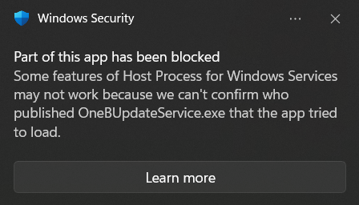
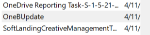
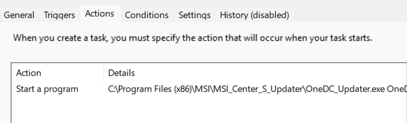

# 🛡️ Incident Analysis: Suspicious OneBUpdateService Blocked by Windows Security

## 📌 Overview

This mini case documents the investigation of a recurring Windows Security alert related to a suspicious executable: `OneBUpdateService.exe`.

The alert indicated that part of the system was blocked due to an unverified application attempting to run.

## 🚨 Initial Alert

* **Source:** Windows Security
* **Message:**
  *"Part of this app has been blocked. We cannot confirm who published OneBUpdateService.exe."*
* **Impact:** Repeated pop-up notifications causing disruption

## 🔍 Investigation Process

### 1. Check Services

* Opened `services.msc`
* ❌ No service named **OneBUpdateService** found
  → Suspicious (process exists but no registered service)

### 2. Check Task Scheduler

* Opened `taskschd.msc`
* Found task:

  * **Name:** `OneBUpdate`
  * **Action:** Executes suspicious updater file

✅ Identified as persistence mechanism

### 3. File Path Analysis

* Related file:

  * `OneBUpdateService.exe` (unverified publisher)

⚠️ Likely not legitimate due to:

* Unknown origin
* Triggered by scheduled task
* Blocked by Windows Defender

### 4. False Positive Check (Important)

* Found similar task:

  * `OneDC_Updater.exe`
* Path:

  * `C:\Program Files (x86)\MSI\MSI_Center_S_Updater\`

✅ Verified as legitimate (MSI software)

🧠 Lesson:

> Similar naming does NOT mean same origin

## 🧹 Remediation
* Deleted scheduled task: `OneBUpdate`
* Removed associated executable file
* Ran:
  * Windows Defender Full Scan
  * Microsoft Defender Offline Scan

✅ Result: No further alerts after restart

## 🧠 Key Takeaways
* Persistence mechanisms may exist outside of Services (e.g., Task Scheduler)
* Unknown executables with no verified publisher should be treated as suspicious
* Always verify file paths before deleting (avoid removing legitimate software)
* Naming similarities can be misleading

## 🎯 Conclusion
This case demonstrates a basic but realistic scenario of detecting and removing a suspicious persistence mechanism on a Windows system.
It highlights the importance of:
* Systematic investigation
* Verifying legitimacy before action
* Understanding common persistence techniques

## 🧩 Skills Demonstrated
* Basic incident investigation (SOC Level 1)
* Windows system analysis
* Persistence detection
* Threat validation and remediation

