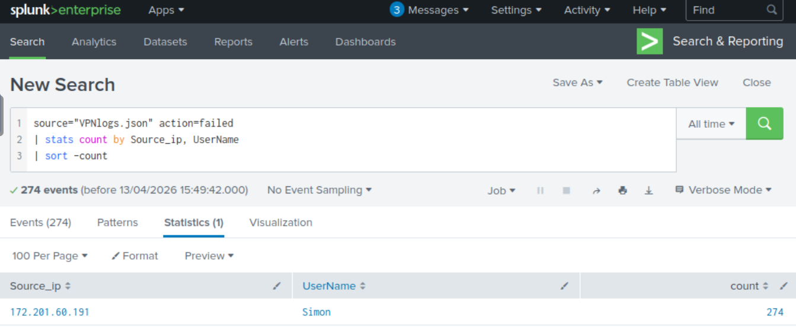
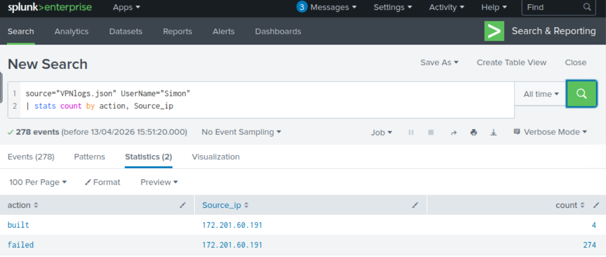
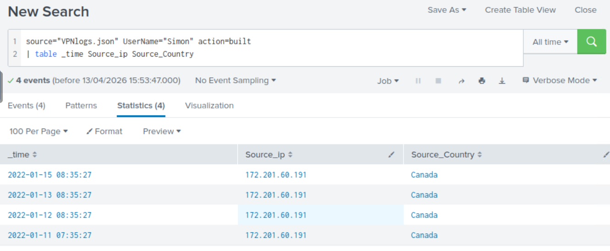

# 🔐 VPN Brute Force & Account Compromise Investigation (Splunk)

## 📌 Scenario

A VPN log dataset was analyzed to identify suspicious authentication activity.
This investigation was conducted independently (without predefined lab questions), simulating a real-world SOC analysis workflow.

## 🧩 Notes
* Dataset used is a simulated VPN log file for training purposes
* Analysis focused on detecting real-world attack patterns using Splunk SPL

## 🔍 Investigation Process
### 1. Identify Failed Login Attempts

```
source="VPNlogs.json" action=failed
| stats count by Source_ip, Username
| sort -count
```

* Found **274 failed login attempts**
* All attempts originated from:

  * **IP:** 172.201.60.191
  * **User:** Simon

👉 Indicates a potential brute force attack targeting a specific account.



### 2. Compare Failed vs Successful Logins

```
source="VPNlogs.json" UserName="Simon"
| stats count by action, Source_ip
```

* **Failed:** 274 attempts
* **Successful (built):** 4 logins
* All activity came from the same IP address
👉 Confirms brute force attack **resulted in successful authentication**.


 
### 3. Analyze Timeline and Geolocation

```
source="VPNlogs.json" UserName="Simon" action=built
| table _time Source_ip Source_Country
```

* Country: **Canada**
* First successful login:
  * 📅 January 11, 2022 at 07:35 AM
* Subsequent logins:
  * January 12–15, 2022
  * Consistently around **08:35 AM**

👉 Repeated logins occurring at consistent times suggest potential automated or habitual attacker behavior.



## 🧠 Key Findings
* A **single IP (172.201.60.191)** targeted a single user (**Simon**)
* A high volume of failed login attempts (**274**) was observed
* The attacker successfully authenticated (**4 times**)
* Repeated logins occurred over multiple days at consistent times
* Activity originated from a single country (Canada)


## 🚨 Conclusion
This activity strongly indicates a:
> **Successful brute force attack leading to account compromise, followed by persistent unauthorized access.**


## 🛡️ Recommended Next Steps
* Reset password for the compromised account
* Block or monitor IP address (172.201.60.191)
* Implement alerting for:
  * High number of failed login attempts
  * Successful login after multiple failures
* Investigate post-login activity for potential lateral movement or data access
* Enforce stronger authentication mechanisms (e.g., MFA)

## 🧠 Skills Demonstrated
- Log analysis using Splunk SPL  
- Detection of brute force attacks  
- Identifying account compromise  
- Basic incident investigation workflow  
